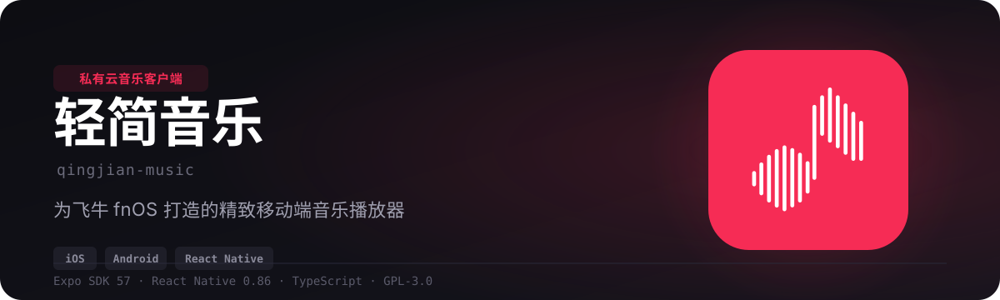
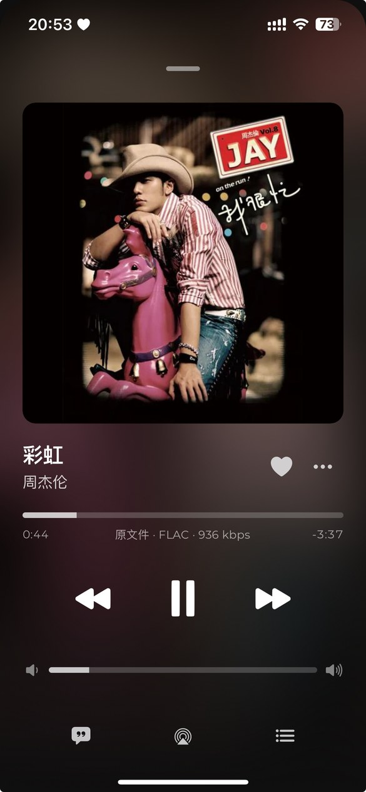
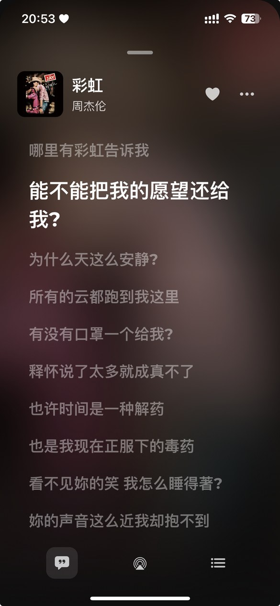
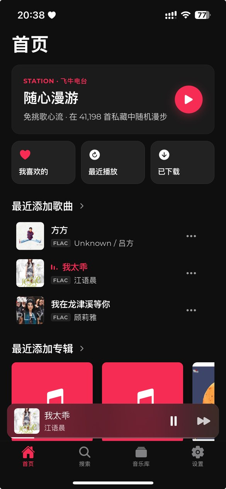
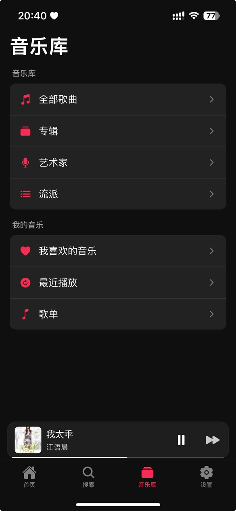
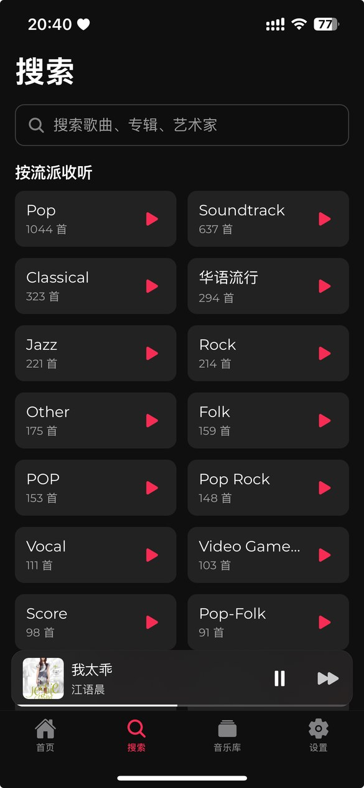

<p align="center">
  
</p>

<p align="center">
  <a href="../../releases">📦 下载</a> ·
  <a href="docs/README.md">📚 文档索引</a> ·
  <a href="docs/build-and-ci.md">🔧 构建文档</a> ·
  <a href="CONTRIBUTING.md">🤝 参与贡献</a>
</p>


## 这是什么

飞牛 fnOS 的音乐服务以网页端形式提供（`http://<你的NAS>:5666/music/`）。
**轻简音乐**把同一套曲库搬到手机上：填一次服务器地址，就能浏览曲库、看歌词、后台播放、离线缓存 ——
音频流量全部留在你自己的网络里，不经过任何第三方。

> 本应用**仅作为播放控制与流媒体连接工具**，不提供、不存储、不分发任何音频资源 ——
> 你播放的内容全部来自你自己部署的 NAS。

<p align="center">
  
  
</p>

<p align="center">
  
  
  
</p>

## 核心能力

| 能力 | 说明 |
|------|------|
| **播放** | 后台播放、锁屏 / 控制中心 / 车机控制、上一首直切、随机与三档循环 |
| **歌词** | 整屏歌词、逐行高亮、暂停后自由滑动、时间轴偏移可调 |
| **曲库** | 歌曲 / 专辑 / 艺术家 / 流派 / 歌单 / 收藏 / 最近播放 / 播放历史 |
| **搜索** | 关键字联想、按类型分标签展示 |
| **格式兜底** | DSD / APE / WMA 等不可播格式自动走服务端 HLS 转码 |
| **离线缓存** | 听过的音频与封面自动本地缓存，弱网断网可续播；支持容量上限与一键清理 |
| **音质偏好** | Wi-Fi / 蜂窝分别设置偏好（仅在后端真正支持码率档位时生效） |
| **外观** | 多套 App 图标、深浅色跟随系统 |
| **多服务器** | 可添加并切换多台飞牛 NAS |

---


## 前提

一台装了「音乐」应用的飞牛 NAS，且手机与它在同一网络（或已做内网穿透）。

首次打开后在登录页填入服务器地址，例如 `http://192.168.1.10:5666`。

## 安装

### Android

从 [Releases](../../releases) 下载 `qingjian-music-android.apk`，传到手机点击安装（需要允许「安装未知来源应用」）。

### iOS（自签）

没有付费开发者账号也能装，用你自己的 Apple ID 自签：

1. 从 [Releases](../../releases) 下载 `qingjian-music-unsigned.ipa`；
2. 用 [Sideloadly](https://sideloadly.io/) / [AltStore](https://altstore.io/) / ESign 等工具导入安装；
3. 免费 Apple ID 签的应用**有效期 7 天**，到期重签一次即可。

> 仓库发布的是**未签名**包，签名由你在本地完成，我们不接触你的凭据。

---


## 工程结构

```
apps/mobile            Expo SDK 57 + React Native 0.86 客户端
packages/core-domain   领域模型与能力声明（Track / Album / QueueItem / Capabilities …）
packages/provider-api  音乐源抽象：MusicProvider 契约、连接与注册表
packages/provider-fnos 飞牛 fnOS 实现（端点表、鉴权、HLS 转码会话）
docs/                  构建与 CI、飞牛 API、转码机制、设计令牌、许可
```

「音乐源」是可插拔的：`MusicProvider` 的可选方法由 `capabilities` 门控，新增一个后端不需要改 UI。

## 本地开发

需要 Node >= 22 与 pnpm。

```bash
pnpm install
node scripts/verify.mjs          # 快速校验：架构守卫 + 文档事实守卫 + ESLint + 类型检查 + 单测
node scripts/verify-full.mjs     # 每次修改后必跑：快速校验 + SwiftLint + iOS Release 编译与产物校验
```

> `verify-full.mjs` 需要 macOS、Xcode 与 CocoaPods。它会从配置重新生成 iOS 工程，
> 做无签名的 Release 设备版编译，并验证 `main.jsbundle`、版本号、arm64、IOS 平台及无描述文件。
> SwiftLint 固定版本并启用严格模式，任何 warning 都会让验证失败。push / PR 的 CI 也执行同一套 iOS 校验。

```bash
pnpm start          # 起 Metro
pnpm ios            # 本机跑 iOS
pnpm android        # 本机跑 Android
```

### 几条硬规矩

这些规则都有机械校验兜底，不是靠自觉：

- **纯逻辑一律放 `*-policy.ts`**，且不许 import `react-native` / `expo` —— 单测能直接跑
- **触感统一走 `src/lib/haptics.ts`**，不要在调用点手写 `Haptics.*`
- **存量债务棘轮**：守卫违规数与 ESLint 警告数都记了基线，**只减不增**
- **SwiftLint 必须 0 warning**，并且每次修改后必须通过 iOS Release 设备版编译与产物校验
- **加校验规则时必须先造一个违规样本验证它会失败** —— 一条永远通过的规则比没有规则更糟

完整的代码约定与 PR 要求见 [`CONTRIBUTING.md`](CONTRIBUTING.md)。

## 自己构建

本机不需要装 JDK / Android SDK —— 出包交给 GitHub Actions：

```
Actions → Build → Run workflow
```

打 tag 会自动出包并挂到 Release：

```bash
git tag v0.1.0 && git push origin v0.1.0
```

完整的构建说明见 [`docs/build-and-ci.md`](docs/build-and-ci.md)。

## 发行版与许可

同一份代码出两种包，由构建期的 `EXPO_PUBLIC_EDITION` 决定；两种包的许可也不同：

| 发行版 | 说明 | 许可 |
|--------|------|------|
| `community`（缺省） | 完整功能，不含任何购买链路。GitHub 上发布的就是这个 | **GPL-3.0-only** |
| `store` | 上架 App Store 的商店版，含永久会员购买 | 单独的**商业许可**，不适用 GPL |

社区版会一直保持 GPL-3.0：你可以自由使用、修改、再分发，而**衍生物也必须开源**。
商店版之所以不受 GPL 约束，唯一依据是**版权集中在项目所有者手里** ——
因此本项目要求贡献者同意 CLA。

- 许可全文：[`LICENSE`](LICENSE)
- 双轨许可的完整推导（为什么不选 AGPL、为什么 App Store 与 GPL 冲突）：[`docs/licensing.md`](docs/licensing.md)
- 发行版判定逻辑：`apps/mobile/src/lib/edition-policy.ts`，关于页会显示当前发行版

---

## 致谢

播放体验的部分设计思路参考了 [CyMusic](https://github.com/gyc-12/Cymusic)，详见 [`NOTICE`](NOTICE)。
